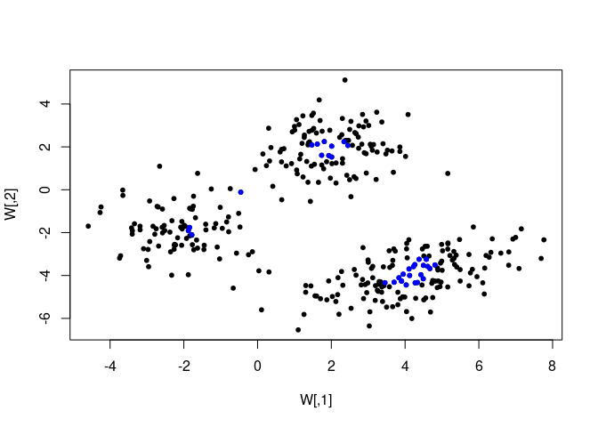

<!-- README.md is generated from README.Rmd. Please edit that file -->

# idld

<!-- badges: start -->

<!-- badges: end -->

The goal of idld is to provide the necesary functions to calculate the
integrated local dual depth in multivariate and functional data cases.

## Installation

You can install the released version of idld from
[GITHUB](https://www.github.com) with:

``` r
install.packages("remotes")
remotes::install_github("lfernandezpiana/idld")
```

## Multivariate Example

This is a basic multivariate example in \(\mathbb{R}^2\) which shows how
to use the idld\_m function to calculate the integrated dual local
depth. In the plot below, blue points represents the local depth central
region.

``` r
library(idld)
library(mvnfast)
X = rmvn(90,  c(-2,-2), sigma=diag(rep(1,2)))
Y = rmvn(110, c(2,2), sigma=diag(rep(1,2)))
Z = rmvn(150, c(4,-4), sigma = rbind(c(2,0.8),c(0.8,1)))
W = rbind(X,Y,Z)
local_depth = idld_m(W, W ,0.3, 500, TRUE)
#> [1] "Generating random projections"
#> [1] "Procesing univariated depths"
plot(W, pch=20)
local_depth_center_region = which(local_depth>quantile(local_depth,0.9))
points(W[local_depth_center_region,], col="blue", pch=20)
```


