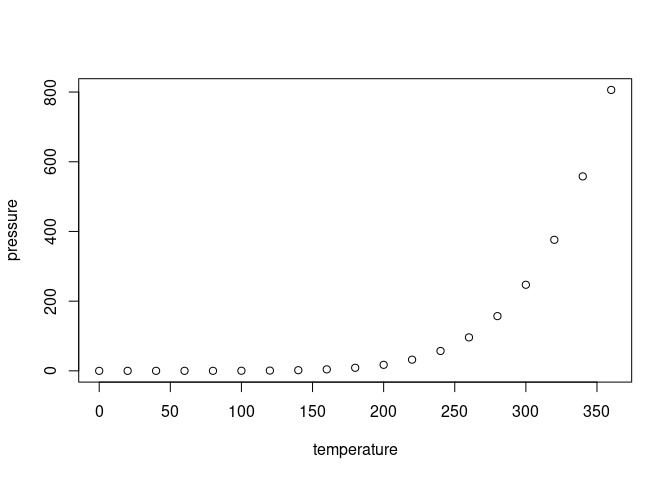

<!-- README.md is generated from README.Rmd. Please edit that file -->

# idld

<!-- badges: start -->

<!-- badges: end -->

The goal of idld is to …

## Installation

You can install the released version of idld from
[CRAN](https://CRAN.R-project.org) with:

``` r
install.packages("idld")
```

## Example

This is a basic example which shows you how to solve a common problem:

``` r
library(idld)
library(mvnfast)
X = rmvn(90,  c(-2,-2), sigma=diag(rep(1,2)))
Y = rmvn(110, c(2,2), sigma=diag(rep(1,2)))
Z = rmvn(150, c(4,-4), sigma = rbind(c(2,0.8),c(0.8,1)))
W = rbind(X,Y,Z)
local_depth = idld_m(W, W ,0.3, 500, TRUE)
#> [1] "Generating random projections"
#> [1] "Procesing univariated depths"
plot(W, pch=20)
local_depth_center_region = which(local_depth>quantile(local_depth,0.9))
points(W[local_depth_center_region,], col="blue", pch=20)
```


What is special about using `README.Rmd` instead of just `README.md`?
You can include R chunks like so:

``` r
summary(cars)
#>      speed           dist       
#>  Min.   : 4.0   Min.   :  2.00  
#>  1st Qu.:12.0   1st Qu.: 26.00  
#>  Median :15.0   Median : 36.00  
#>  Mean   :15.4   Mean   : 42.98  
#>  3rd Qu.:19.0   3rd Qu.: 56.00  
#>  Max.   :25.0   Max.   :120.00
```

You’ll still need to render `README.Rmd` regularly, to keep `README.md`
up-to-date. `devtools::build_readme()` is handy for this. You could also
use GitHub Actions to re-render `README.Rmd` every time you push. An
example workflow can be found here:
<https://github.com/r-lib/actions/tree/master/examples>.

You can also embed plots, for example:



In that case, don’t forget to commit and push the resulting figure
files, so they display on GitHub and CRAN.
